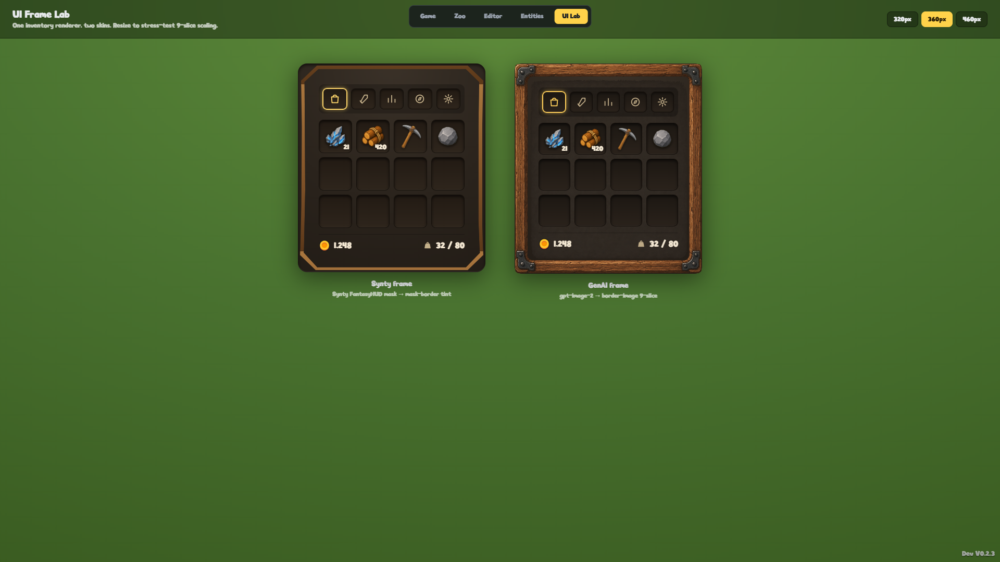
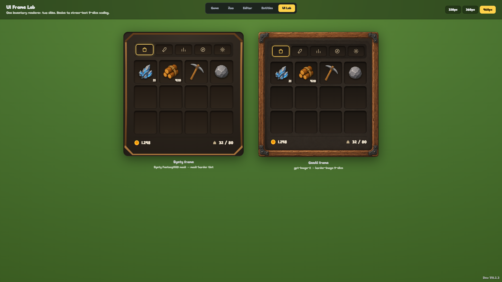

# UI Frame Lab — research spike findings

A throwaway-grade exploration of a textured, RuneScape-style inventory panel for
the wider UI overhaul. Goal: find out how capable we are of building reusable,
modular textured UI frames, and whether the GenAI image pipeline can produce
usable frame art.

Open it in dev at **`#/ui-lab`** (dev-only route). It renders the target
inventory mockup twice from one renderer, skinned two ways, side by side.

## TL;DR verdict

**GenAI frames are viable — and were the better-looking of the two.** A single
`gpt-image-2` pass produced a warm wooden panel with iron corner brackets and a
recessed interior that 9-slices cleanly with CSS `border-image` and holds up at
every size with no seams or broken corners. It closely matches the mockup.

Recommendation: **formalise a `ui-frame` Sprite Pipeline preset** (spec below) as
a sprint item, and adopt the `Frame` 9-slice primitive as the basis of the UI
overhaul.

| Result @360px | Result @460px |
|---|---|
|  |  |

Left = Synty mask tinted via `mask-border`. Right = GenAI `border-image` 9-slice.

## What was built

- `apps/client/src/ui/lab/Frame.tsx` — the reusable 9-slice primitive. One
  component, two modes:
  - `border-image` — the PNG bakes its own colour/texture (the GenAI frame).
  - `mask-border` — a white silhouette mask recoloured with a CSS gradient (the
    Synty HUD sprites ship as white masks; this tints them to our palette).
  - Art is painted on absolutely-positioned layers *behind* the content, so
    masking never clips slots/tabs/labels.
- `apps/client/src/ui/lab/skins.ts` — `PanelSkin` data (frame spec + tokens).
  Swapping the whole look is pure data — the modularity proof.
- `apps/client/src/ui/lab/InventoryMock.tsx` — the non-functional mockup (tab
  strip with gold active highlight, 4-wide slot grid using real item icons,
  gold/weight footer).
- `apps/client/src/modes/UiLabMode.tsx` + `#/ui-lab` route in `App.tsx`.
- `tools/spritegen/scripts/gen-ui-frame.mjs` — ad-hoc frame generator (NOT the
  formal pipeline; see below).
- `tools/spritegen/scripts/key-frame.mjs` — flood-fill background knockout.

## GenAI generation notes (how the frame was made)

The existing Sprite Pipeline can't make frames as-is: its post-processing trims
and re-centres an isolated subject and mattes the background, and the style bible
explicitly forbids borders/frames. So this spike bypassed it:

1. `gpt-image-2` `images.edit`, anchored to our own painterly wood references
   (`T_Item_WoodLogs`, `T_Item_OakWood`, `T_Entity_WoodShack_Built`).
2. Prompt asked for a **full-bleed** panel (wood border edge-to-edge + dark
   recessed interior), since gpt-image-2 can't emit transparency. `n=3`,
   1024×1024, opaque, high quality. All three candidates were usable;
   `frame_1` was chosen (`genai-frame-raw.png`).
3. Background knockout: gpt-image paints on a dark background, and a naive
   luminance key also eats the dark interior + inner-shadow groove. Solution:
   **flood-fill from the image edges** at a per-channel threshold of 40, so only
   the background-connected dark region clears and the enclosed interior is
   always preserved (`genai-frame-keyed.png`).
4. The transparent inner groove the key leaves behind is **harmless**: the frame
   is used as a `border-image` border (no `fill`) over a CSS-painted dark
   interior `body`, so the body shows through the groove seamlessly.

## Rendering technique: CSS 9-slice (`border-image` / `mask-border`)

- `border-image-slice: <inset> fill` + `border-image-width` is all it takes;
  wrapped in `<Frame>` so callers never touch raw `border-image`.
- DOM-native, GPU-cheap, no extra runtime — fits the existing React + global
  `styles.css` architecture (no new dependency).
- Corner brackets sit in the slice corners (fixed), wood edges stretch. Slot
  bevels and the active-tab glow are pure CSS (`inset box-shadow`,
  `color-mix`).

## Synty vs GenAI

| | Synty (`mask-border` tint) | GenAI (`border-image`) |
|---|---|---|
| Look vs mockup | Clean tinted wooden octagon; flatter, no brackets/grain | Carved wood + iron brackets + grain; matches mockup |
| Source | Pre-made white mask, instant, zero spend | One image-model pass (~seconds, small cost) |
| File size | ~14 KB | ~1.7 MB raw PNG (needs optimisation — see below) |
| Recolour | Trivial (change the gradient) | Re-generate or hand-edit |
| Risk | None | Background knockout + slice tuning needed |

Both are legitimate. Synty is the fast, recolourable path; GenAI gives the
characterful, on-brand look. They can coexist — same `Frame` primitive.

## Proposed `ui-frame` Sprite Pipeline preset (formalisation sprint)

If we adopt this, turn the ad-hoc scripts into a real preset:

1. **New preset `ui-frame`** in `tools/spritegen/src/presets/` with a frame-
   specific prompt (full-bleed, uniform border, recessed interior, transparent-
   outside intent) and wood/UI references.
2. **Post-processing branch**: skip the trim/recentre/matte path; instead run the
   edge flood-fill knockout (port `key-frame.mjs`) and **leave the frame at full
   canvas** (no margin reframing).
3. **Relaxed QA**: the 3–85% fill check assumes a compact subject; a frame is
   mostly border + interior. Add a frame-aware check (border present on all four
   sides, interior enclosed, corners transparent).
4. **Asset routing**: add a `T_UI_` prefix → `AvailableAssets/UI/` mapping in
   `assetPaths.ts`, and (optionally) auto-wire into the manifest.
5. **Optimise output**: 1.7 MB is too heavy for UI. Quantise/compress the PNG
   (palette PNG or downscale the master to ~512), or emit a slimmer 9-slice
   atlas. Target < 100 KB per frame.
6. **Slice metadata**: emit the recommended `border-image-slice` inset alongside
   the PNG so `Frame` specs aren't hand-measured.

## Other notes / improvements for later

- **Promote `Frame` to a real primitive** (out of `ui/lab/`) and migrate the
  actual `Bag` + modals to it during the overhaul. Consider an ADR for the UI
  frame system + a `CONTEXT.md` term (e.g. "Frame"/"Panel skin") at that point.
- **Token-drive the whole HUD**: skins here are local; the overhaul should hang
  panel skins off the existing `:root` CSS variables so one switch reskins
  everything.
- **`mask-border` browser support** is Chromium-prefixed (`-webkit-mask-box-image`)
  + the standard `mask-border`; fine for our target, but note it for Firefox.
- **Generate a matching slot + tab sprite** via the same preset so slots aren't
  pure CSS bevels — would close the last gap to the mockup.
- **Decorative overlays** (Synty `Tracery_*`, emblems) can be layered as absolute
  corner pieces on top of `Frame` for flourish without touching the 9-slice.

_This folder is research scratch: `genai-frame-raw.png` (model output),
`genai-frame-keyed.png` (background knocked out), and the lab screenshots._
